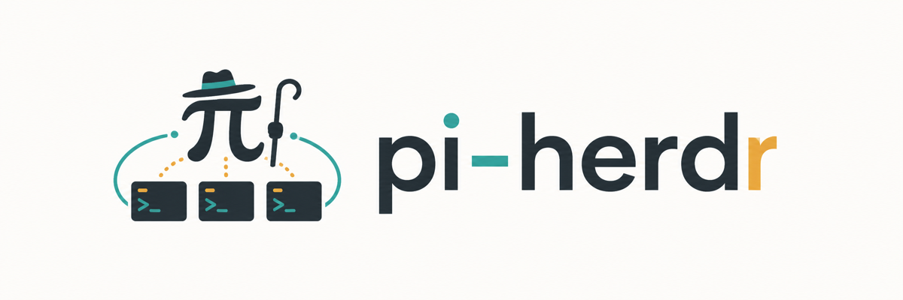

# pi-herdr



pi-herdr 是一个 [Pi](https://github.com/earendil-works/pi) 扩展，让你在 [Herdr](https://herdr.dev) 中把任务交给独立 tab 里的后台 Agent。每个 Agent 都有自己的持久 Pi session，会保留上下文，可以反复接收任务、回复结果，并与其他 live Pi 会话通信。

## Installation

需要 Herdr 0.7.5 或更高版本、Pi 0.83 或更高版本，以及 Node.js 22.19 或更高版本。

```bash
pi install npm:@kkkiio/pi-herdr
```

## Usage

在 Herdr 中启动 Pi, 然后直接让 Pi 创建一个 Agent：

```text
创建一个 explorer Agent，调查认证逻辑在哪里实现，并把结论回复给我。
```

Agent 会在单独的 tab 中工作。使用 `/agents` 可以查看当前 live 的 Agent 和 Pi peer；需要继续调查时，继续告诉 Pi：

```text
让刚才的 explorer Agent 再检查刷新令牌的错误处理，并回复新增发现。
```

新 Agent 使用 Pi 默认配置，能力与创建者相同，适合实现、测试和开放式任务；只读调查等约束直接写在当次任务描述里。

Agent 的 pane 保持运行时，其 session 和上下文可以持续复用。关闭 pane 或 tab 会停止对应的 live Agent，但不会删除 Pi session 或可选 worktree。

## Herdr RPC Support

pi-herdr 只封装后台 Agent 工作流需要的 Herdr 能力，不替代 Herdr 自身的 workspace、tab、pane 或 worktree 管理。

| Pi 能力                     | Herdr RPC                                                                     | 用户可见行为                                                   |
| --------------------------- | ----------------------------------------------------------------------------- | -------------------------------------------------------------- |
| `Agent`                     | `tab.create` / `worktree.create`, `tab.rename`, `agent.start`, `agent.prompt` | 在独立 tab 中启动持久 Agent，可选择共享目录或独立 Git worktree |
| `ListAgents`, `SendMessage` | `agent.list`, `agent.prompt`                                                  | 发现并联系 live Agent 或 Pi peer；不提供离线消息队列           |
| 其他 Herdr 管理能力         | 其余 `workspace.*`、`tab.*`、`pane.*`、`worktree.*`、`layout.*`               | 不由 pi-herdr 封装，直接使用 Herdr                             |
