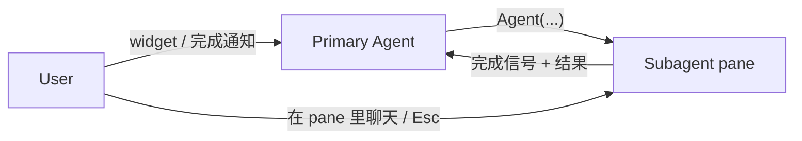

# Subagents

subagent 运行在独立 herdr pane 中，主 agent 通过工具 spawn 它后继续自己的工作；完成时结果自动送回主会话，唤醒主 agent 开启新 turn。

工具集对齐 Claude Code 的 subagent API——同名、同参数、同调用惯例：

| 工具                  | 调用方   | 作用                                               |
| --------------------- | -------- | -------------------------------------------------- |
| `Agent`               | 主 agent | spawn subagent（foreground / background 两种模式） |
| `get_subagent_result` | 主 agent | 查询 / 取回后台 agent 的结果                       |
| `steer_subagent`      | 主 agent | 注入消息重定向；已完成则自动恢复运行               |

消息传递方向：



## Agent — 启动 subagent

两种模式（对齐 Claude Code 官方 `Agent` schema）：

- **foreground**（`run_in_background: false`，默认）：阻塞当前 turn，同步返回完整结果
- **background**（`run_in_background: true`）：立即返回 `async_launched`，完成时自动唤醒主 agent

```typescript
Agent({
  description: string,          // 必填，3-5 词任务描述（显示在 UI，也是给 parent 的标题）
  prompt: string,               // 必填，真正送进 subagent context 的任务说明
  subagent_type?: string,       // 模板/配置：Explore、general-purpose、自定义 agent
  model?: string,               // "sonnet" | "opus" | "haiku" | "fable"，或 fuzzy；省略继承父级
  thinking?: "off"|"minimal"|"low"|"medium"|"high"|"xhigh"|"max",
  max_turns?: number,
  run_in_background?: boolean,  // false → 同步等待完整结果（默认）；true → 立即返回 ID
  name?: string,                // 实例身份，可被 SendMessage / interrupt 定位（默认由类型派生）
  resume?: string,              // 按 agent ID 续跑
  isolated?: boolean,           // 只给内置工具，不给扩展/MCP 工具
  inherit_context?: boolean,    // fork 父会话上下文；默认 false（全新上下文）
  isolation?: "worktree",       // 在临时 git worktree 中运行，完成时提交到分支
})
```

**`subagent_type` 与 `name` 分开**：`subagent_type: "security-reviewer"` 是模板/配置（agent 定义里的 prompt、工具、模型），`name: "auth-reviewer"` 是这次启动出来的**实例身份**——与 Claude Code 的 `Agent(Explore)` 权限规则、以及后续按名定位（SendMessage / interrupt / resume）一致。

**返回**：

- background：`{ status: "async_launched", agentId, name, description }`
- foreground：`{ status: "completed", agentId, content, totalTokens, totalDurationMs }`

规则（写死在工具描述里，防止主 agent 浪费 turn）：

- **background**：不要轮询、不要 sleep、不要反复读日志文件探测完成——完成时会自动被唤醒
- 不要编造或猜测 subagent 的结果；foreground 拿到结果后，声称的代码改动要实际验证
- background spawn 后立刻结束 turn，或并行 spawn 更多 subagent / 做其他独立工作
- 并行任务用**一条消息多个 `Agent` 调用**（`run_in_background: true`），并发执行；foreground 是顺序执行，一次只跑一个

### subagent 侧

**输入**（它收到什么）：

subagent 的会话由三段构成，按序组合：

```
system prompt（来自 subagent_type 模板：角色、规则、工具集、模型）
  + 可选 inherit context（inherit_context: true 时 fork 主会话对话）
  + prompt（你的任务说明，作为它的首个 user 消息）
```

- **system prompt**：由 `subagent_type` 决定——agent 定义（`.pi/agents/<name>.md`）里的角色、规则、工具集、模型。subagent 不继承主 agent 的 system prompt，除非是 `general-purpose` 这类父孪生模板
- **inherit context**：`inherit_context: true` 时 fork 主会话历史，让 subagent 知道当前讨论；否则它只有全新上下文
- **prompt**：任务是自包含的——subagent 没看过主 agent 的对话，prompt 里要交代背景、目标、约束。它作为 subagent 的首条 user 消息注入

**`@file` 的影响**：prompt 较长时间按文件送达（`@file` artifact 展开为任务文件，首条 user 消息变成"读取该文件并执行"）。影响有二：一是多行 prompt 不走 shell 转义，二是文件里可用 `@` 引用项目内其他文件、或在文件头部附加引用。`inherit_context` 时 prompt 直接作为消息送达（无需文件）。

**输出**（它产出什么）：

- 它的最终回复即结果，被 supervisor 捕获并持久化到 task store
- 主 agent 通过完成通知拿到摘要，或 `get_subagent_result` 取完整输出
- 无子代理侧工具——进程退出即完成信号，由父侧 supervisor 负责完成检测、结果捕获与交付（见 ADR）

### user 侧

- widget 立即出现新行，状态从 `starting` 开始流转
- 可直接切到该 agent 的 pane 查看（独立 pane 本身即实时视图）
- 完成/失败时收到通知框

---

## get_subagent_result — 查询 / 取回结果

```typescript
get_subagent_result({
  agent_id: string,             // Agent 返回的 ID
  wait?: boolean,               // true → 阻塞等待完成；默认 false
  verbose?: boolean,            // true → 返回完整对话（含工具调用）；默认 false
})
```

消费结果的同时会**抑制**待发送的完成通知，避免重复打扰。完整结果持久化在 task store 中，不依赖 pane。

---

## steer_subagent — 重定向 / 隐式 resume

```typescript
steer_subagent({
  agent_id: string,
  message: string, // 作为 user 消息注入
});
```

**已完成的 subagent 收到消息后会自动在后台恢复运行**（Claude Code `SendMessage` 语义）——相当于按 ID 的隐式 `resume`。消息作为 user 消息注入会话，**当前工具结束后**生效。

---

## 横切主题

以下内容不属于某个具体工具，而是贯穿所有 subagent 的全局机制。

### 消息回传

后台 agent 的完成不会同步返回，而是通过 custom message 注入主会话：`triggerTurn: true` 在 primary 空闲时自动触发新 turn；`deliverAs: "followUp"` 在 primary 正在工作时排到当前工作完成之后交付（不用 `steer`——那是"打断当前工作"的语义，完成通知是"做完当前的事再处理"）。

| customType        | 触发时机    | 内容                                                                 |
| ----------------- | ----------- | -------------------------------------------------------------------- |
| `subagent_result` | 完成 / 失败 | 摘要 + 耗时 + token + 结果预览（完整输出可用 `get_subagent_result`） |

结构化的 `<task-notification>` XML（含 `<task-id>` / `<status>` / `<result>` / `<usage>`）让主 agent 可解析；用户看到的是主题化的通知框。

### 生命周期

subagent 状态由 **进程 × turn × pane 观察** 三路投影而来，显示在 widget 上：

| 状态                   | 含义                                                      |
| ---------------------- | --------------------------------------------------------- |
| `starting`             | 已启动，pane/活动确认中                                   |
| `active`               | 正在处理（agent turn / provider 请求 / 流式 / 工具执行）  |
| `blocked`              | herdr 报告子进程被阻塞（审批/提问 UI）                    |
| `waiting`              | 当前 turn 结束，进程开着等待更多输入                      |
| `interrupted`          | 当前 turn 被取消（pane 里 Esc），进程仍开 |
| `stalled`              | pane 观察长期不健康，父侧不再信任该运行                   |
| `running`              | 兜底：只知道进程存在                                      |
| `finalizing`           | 完成证据已观测到，结果交付中                              |
| `completed` / `failed` | 终态，行随即从 widget 移除                                |

### 状态 widget（编辑器上方）

```
╭─ Subagents ──────────────────── 1 active · 1 open ─╮
│ 00:23  Scout: Auth (scout)                active · bash 7m │
│ 00:45  Scout: DB (scout)                    waiting 2m │
╰──────────────────────────────────────────────────────╯
```

- 头部统计 **active**（处理中）vs **open**（未处理）；全部 open 时边框变琥珀色
- 每行：elapsed + 名称 + agent 类型 + 投影状态 + 活动详情

### 完成通知框

```
✓ Scout: Auth completed   ↻8 · 5 tool uses · 33.8k token · 12.3s
  ⎿  Found 5 files related to authentication...
  transcript: .pi/output/agent-abc123.jsonl
```

Ctrl+O 展开全文；失败（`✗`）、中止（`✗ Aborted`）、错误（`✗ Error`）分别着色。行从 widget 移除的时机：结果已交付或已抑制。

### 直接操作与命令

- 在 subagent 的 pane 里直接聊天、Esc 打断当前 turn
- 命令：`/subagent <type> <task>`（直接 spawn）、`/iterate`（fork 当前会话做迭代）、`/plan`（规划工作流）
- `/agents` 菜单：查看所有 agent、打开对话、管理设置
