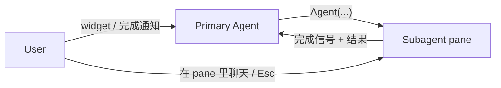

# Subagents

pi-herdr 内置两个 bundled subagent：`explorer`（只读搜索）和 `general-purpose`（通用执行）。它们运行在独立 herdr pane 中，主 agent 通过 `Agent` 工具 spawn 后继续自己的工作；完成时结果通过 `pi.sendMessage` 送回主会话，触发新 turn。

工具集对齐 Claude Code 的 subagent API——同名、同参数、同调用惯例：

| 工具                  | 调用方   | 作用                                               |
| --------------------- | -------- | -------------------------------------------------- |
| `Agent`               | 主 agent | spawn subagent（foreground / background 两种模式） |
| `get_subagent_result` | 主 agent | 查询 / 取回后台 agent 的结果                       |
| `steer_subagent`      | 主 agent | 注入消息重定向；已完成则自动恢复运行               |



## Agent — 启动 subagent

```typescript
Agent({
  description: string,          // 必填，3-5 词任务描述（显示在 UI）
  prompt: string,               // 必填，自包含任务说明
  subagent_type: string,        // 必填；可用值见下
  model?: string | string[],  // 可选，单个模型或有序模型列表
  thinking?: "off" | "minimal" | "low" | "medium" | "high" | "xhigh" | "max",
  max_turns?: number,
  run_in_background?: boolean,  // false（默认）= 同步等待；true = 立即返回 ID
  name?: string,                // 实例身份，可被 steer 定位
  resume?: string,              // 按 agent ID 续跑
  isolated?: boolean,           // 只给内置工具，不给扩展/MCP
  inherit_context?: boolean,    // fork 主会话上下文；默认 false
  isolation?: "worktree",       // 在临时 git worktree 中运行
})
```

**可用 `subagent_type`**：

- `explorer`：只读搜索 agent。
- `general-purpose`：通用 agent，拥有完整工具，可改文件。
- 自定义 agent：来自 `.pi/agents/<name>.md`、`.agents/agents/<name>.md` 或 `~/.pi/agent/agents/<name>.md`。

- `subagent_type` 必填；缺失或空值会报错。
- 未知/禁用的类型回退到 `general-purpose`，与 pi-subagents 的 fallback 行为一致。
- `subagent_type` 是**模板/配置**；`name` 是这次启动的**实例身份**。
- 并行任务：一条消息里发起多个 `Agent(..., run_in_background: true)`。
- background spawn 后不要轮询、不要 sleep——完成时会自动被唤醒。

**返回**

- background：`{ status: "async_launched", agentId, name, description }`
- foreground：`{ status: "completed", agentId, content, totalTokens, totalDurationMs }`

## 内置 explorer

`explorer` 是一个只读搜索 agent，用于定位代码、文件和符号。

- **适用**：按路径找文件、`grep` 符号/关键词、回答 "X 在哪里定义 / 哪些文件引用 Y"。
- **不适用**：代码审查、设计文档审计、跨文件一致性检查、开放式分析。
- **工具**：`read`、`bash`（只读）、`grep`、`find`、`ls`。
- **核心约束**（写进 system prompt）：
  - 不创建、不修改、不删除文件。
  - 不使用重定向、`heredoc` 等会改变系统状态的命令。
  - Bash 仅用于 `ls`、`git status`、`git log`、`git diff`、`find`、`cat`、`head`、`tail` 等只读操作。
  - 使用 `find`/`grep`/`read` 工具，而不是 bash 版本的同名命令。

## 内置 general-purpose

`general-purpose` 是通用执行 agent，负责把复杂、多步骤的任务委托出去。与 `explorer` 不同，它可以创建和修改文件。

- **适用**：实现需求、重构代码、跑测试、写文档、任何需要多步自主执行的任务。
- **不适用**：简单、一次性的查找（用 `explorer` 更便宜）。
- **工具**：全部内置工具，包括 `edit` 和 `write`。
- **模型**：默认继承主 agent 当前模型；可通过 `model` 参数或自定义 frontmatter 覆盖，`model` 可以是单个字符串或有序数组。

## 默认模型选择

### explorer

explorer 的默认模型**不是**直接继承主 agent 的当前模型。继承当前模型虽然简单，但经常会让用户意外烧掉高价模型的 token，因此采用“按可用模型优先列表动态选择”的策略。

#### 选择顺序

`model` 可以是单个字符串，也可以是有序数组。如果是数组，则按顺序尝试，第一个“可用”的即为 effective model；如果全部不可用，回退到主 agent 当前模型。

explorer 的 bundled 默认 `model` 为：

```yaml
model:
  - gpt-5.6-luna
  - deepseek-v4-flash
```

选择顺序：

1. **调用方显式指定**：`Agent({ model: "..." })` 或 `Agent({ model: ["...", "..."] })`。注意这不会绕过 `subagent_type` 的必填要求。
2. **自定义 agent frontmatter 里的 `model`**：单个字符串或数组。
3. **内置 agent 的默认 `model`**：`explorer` 默认是上述数组；`general-purpose` 默认未设置，继承父模型。
4. **最后防线**：继承主 agent 当前模型。

#### 何为“可用”

“可用”指同时满足两条：

- 该模型已在 pi 的 model registry 中，并且用户已完成认证/登录（即 `registry.getAvailable()` 包含它）。
- 如果用户在 pi 设置里配置了 `enabledModels`，该模型还需在该白名单内。

偏好列表按 **model id** 匹配，不绑定固定 provider。例如 `gpt-5.6-luna` 可能对应：

- `opencode-go/gpt-5.6-luna`
- `opencode/gpt-5.6-luna`

`deepseek-v4-flash` 可能对应：

- `deepseek/deepseek-v4-flash`
- `opencode-go/deepseek-v4-flash`
- `opencode/deepseek-v4-flash`

匹配时把 `.` 与 `-` 视为等价（与 pi-subagents 的 `resolveModel` 保持一致）。

#### 回退行为

当偏好列表里的模型全部不可用时，回退到主 agent 当前模型。与 pi-subagents 的 `resolveDefaultModel` 行为一致：配置模型找不到时静默继承父模型，不弹出额外警告。

### general-purpose

`general-purpose` 的默认模型策略与 explorer 相反：**默认继承主 agent 当前模型**。原因是通用任务通常需要与主 agent 同等级的能力，强制换到便宜模型反而可能做不完或质量下降。

- `general-purpose` 默认继承父模型。
- 可通过 `Agent({ model: "..." })` 单次覆盖。
- 可通过自定义 `.pi/agents/general-purpose.md` 或 `.agents/agents/general-purpose.md` 的 frontmatter `model: ...` 覆盖。

## 自定义 Agent

除内置 `explorer` 和 `general-purpose` 外，用户可以在以下位置添加自定义 agent：

- 项目级：`.pi/agents/<name>.md`
- 工作区级：`.agents/agents/<name>.md`
- 全局级：`~/.pi/agent/agents/<name>.md`

项目级优先级最高，覆盖工作区级和全局级；工作区级覆盖全局级。同名文件完全覆盖对应的内置 agent。

frontmatter 示例：

```markdown
---
model: deepseek/deepseek-v4-flash
thinking: low
max_turns: 20
---

你是一个专注于 API 兼容性的只读审查 agent。
```

自定义 agent 会出现在 `Agent` 的可用 `subagent_type` 列表中。

## get_subagent_result / steer_subagent

```typescript
get_subagent_result({
  agent_id: string,
  wait?: boolean,
  verbose?: boolean,
})
```

消费结果会抑制待发送的完成通知。`verbose: true` 返回完整对话。

```typescript
steer_subagent({
  agent_id: string,
  message: string,
});
```

向运行中的 subagent 注入一条 user 消息；已完成的 subagent 收到消息后会自动恢复运行。

## 生命周期与通知

### 完成通知

后台 agent 完成后，supervisor 向主会话发一条自定义消息，让主 agent 继续工作：

```typescript
pi.sendMessage(
  { customType: "subagent_result", content: "...", details: { ... } },
  { deliverAs: "followUp", triggerTurn: true }
);
```

- `triggerTurn: true`：主 agent 空闲时立即开新 turn。
- `deliverAs: "followUp"`：主 agent 正在工作时，等当前工作结束再交付，不打断它。
- `get_subagent_result` 消费结果后会取消这条通知，避免重复打扰。

### 完成检测

subagent 默认是 **non-persistent**，但运行期间仍然要写一个临时 pi session 文件（jsonl），方便另一个进程里的 supervisor 读取结果。完成检测分两步：

1. **`agent.wait`（主要方式）**：对每个 background subagent 调用一次 herdr 的 `agent.wait`，等到 pane 里的 agent settle（`done` / `error` / `unknown`）。
2. **读临时 session jsonl**：`agent.wait` 返回后，supervisor 读取 subagent 的临时会话文件，取出最后一条 assistant 消息作为结果，然后缓存到内存里。`get_subagent_result` 直接从内存缓存读结果，不依赖临时文件。

临时 session 文件可以保留一段时间（例如 10 分钟）用于排错，之后清理。

### Widget 状态

widget 状态尽量跟 herdr `agent list` / `agent.get` 返回的 `agent_status` 对齐，只在必要时做一层映射：

| herdr `agent_status`        | widget 显示 | 含义                                                                                  |
| --------------------------- | ----------- | ------------------------------------------------------------------------------------- |
| `idle`                      | `idle`      | agent 没在干活；如果 subagent 还没结束，就是等下一轮输入                              |
| `working`                   | `working`   | agent 正在处理                                                                        |
| `blocked`                   | `blocked`   | agent 被阻塞，等用户批准/回答                                                         |
| `done`                      | `done`      | agent 已经完成；session jsonl 已可读取                                                |
| `unknown`                   | `unknown`   | herdr 无法判断状态；supervisor 会检查 session jsonl，决定最终是 `done` 还是 `error`   |
| （agent 还没被 herdr 识别） | `starting`  | pane 刚创建，herdr 还没检测到 agent                                                   |
| （socket 断开）             | `error`     | 连接失败，无法继续观察                                                                |

### 持久化与 resume

- 默认 subagent 是 non-persistent，结果只保留在 supervisor 内存里；临时 session 文件保留 10 分钟用于排错。
- 如果 agent frontmatter 写了 `persist_session: true`，则 session 文件不会被删除，支持 `resume` 续跑。
- `resume` 只对 persistent subagent 有效；对 non-persistent subagent 调用会报错。

## 命令

| 命令              | 作用                         |
| ----------------- | ---------------------------- |
| `/agents`         | 列出运行中/可用的 agent      |
| `/iterate`        | fork 当前会话做迭代          |
